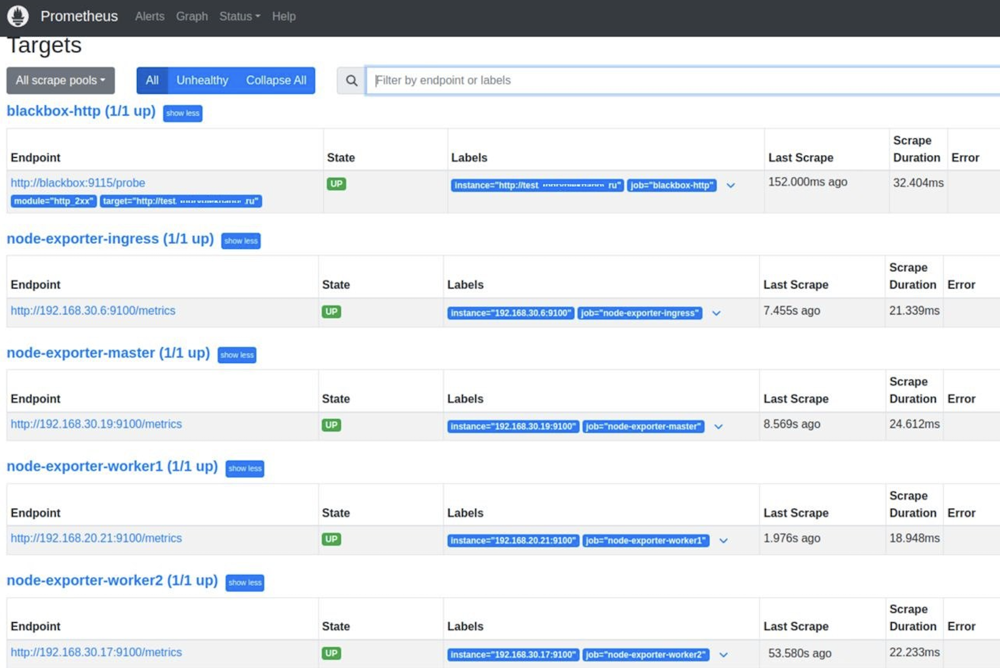
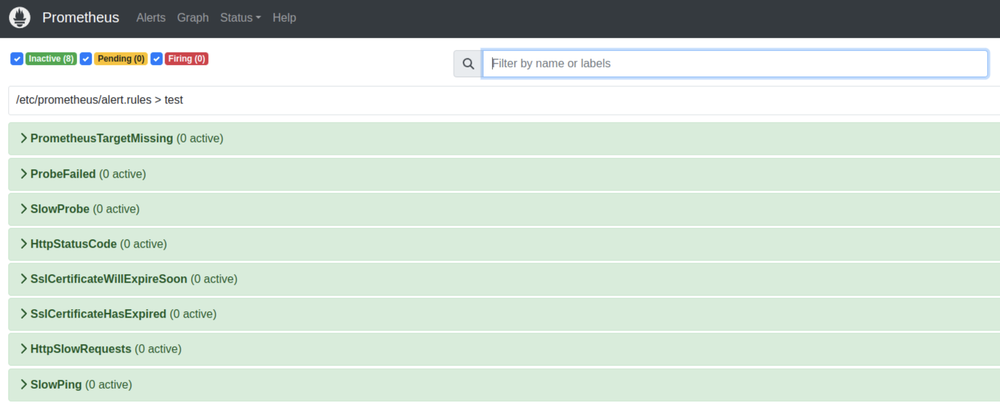
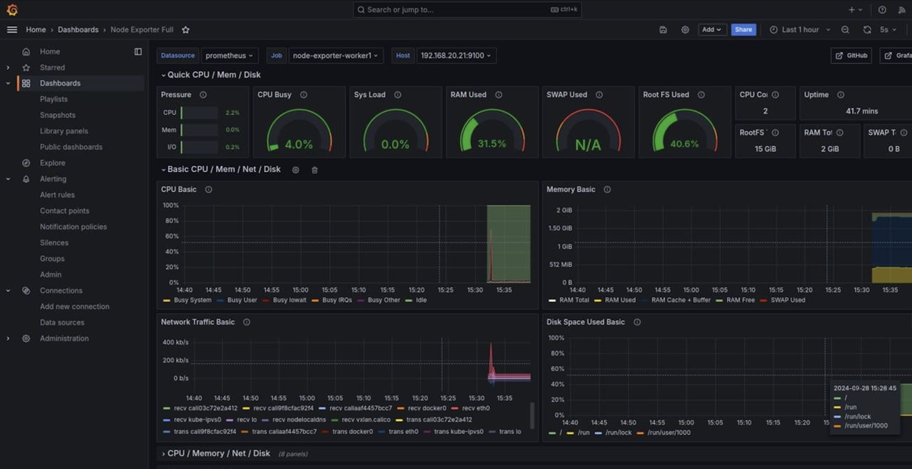
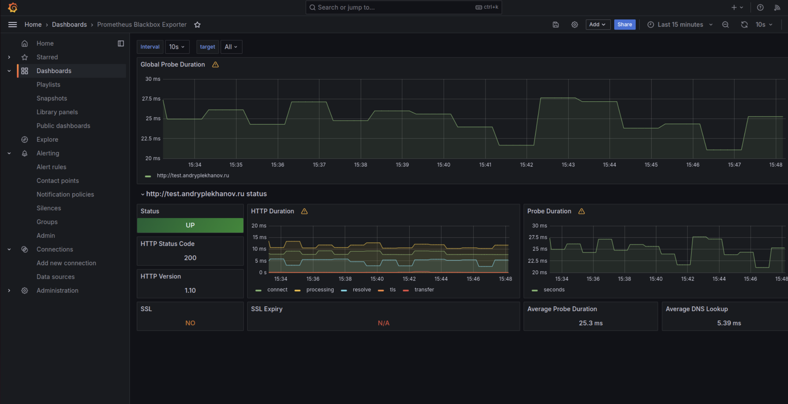
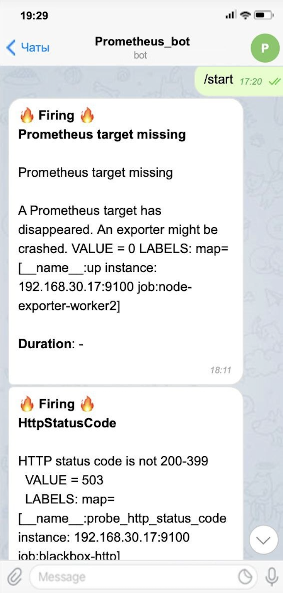

# SF DevOps Diploma - Sprint 3 - Monitoring/Logging/Alerting


## Задача
```
1 Настройка сборки логов.
Представьте, что вы разработчик, и вам нужно оперативно получать информацию с ошибками работы приложения.
Выберите инструмент, с помощью которого такой функционал можно предоставить. Нужно собирать логи работы пода приложения. Хранить это все можно либо в самом кластере Kubernetes, либо на srv-сервере.

2 Выбор метрик для мониторинга.
Так, теперь творческий этап. Допустим, наше приложение имеет для нас некоторую важность. Мы бы хотели знать, когда пользователь не может на него попасть — время отклика, сертификат, статус код и так далее. Выберите метрики и инструмент, с помощью которого будем отслеживать его состояние.
Также мы хотели бы знать, когда место на srv-сервере подходит к концу.

3 Настройка дашборда.
Ко всему прочему хотелось бы и наблюдать за метриками в разрезе времени. Для этого мы можем использовать Grafana и Zabbix — что больше понравилось.

4 Алертинг.
А теперь добавим уведомления в наш любимый мессенджер, точнее в ваш любимый мессенджер. Обязательно протестируйте отправку уведомлений. Попробуйте «убить» приложение самостоятельно, и засеките время от инцидента до получения уведомления. Если время адекватное, то можно считать, что вы справились с этим проектом!
```

---
## Решение

Выбран стэк мониторинга **Prometheus + Loki + Grafana + Alertmanager** с разверткой при помощи ролей **Ansible**.

---

### Общая логика
1. На сервер **srv** и все ноды кластера устанавливается **node-exporter**, для мониторинга самих хостов.
2. Также на ноды кластера устанавливается **promtail** для сбора логов.
3. На самом сервере **srv**:
   - loki для сбора логов от promtail;
   - prometheus, grafana - для сбора метрик и их визуализации;
   - blackbox - для мониторинга веб страницы с приложением;
   - alertmanager и alertmanager-bot для алертинга.

---

### Роли

**exporters**:
1. На нодах создается директория `/opt/node-exporter`, внутрь копируется **dockercompose.yml** файл из директории `files` роли, с помощью **docker compose** запускаются сервисы **node-exporter**.

**monitoring**:
1. На сервере **srv** в директории `/opt` создаем сабдиректории для новых сервисов.
2. На сервер **srv** копируется **docker-compose.yml**, который формируется из шаблона **docker-compose-template.j2**. Для формирования файла используются переменные зашифрованного с помошью ansible-vault файла `vars/main.yml`, в нем содержится токен и id пользователя.
3. Конфигурация **node-exporters** формируется динамически с помощью шаблона **exporters.yml.j2** на основе данных указанных в файле **hosts**.
4. Копируем все необходимые файлы конфигурации из директории `/files`, и сервисы запускаются с помощью **docker compose**.

**logging**:
1. На сервере **srv** создается директория `/opt/promtail`, в нее копируется `values.yml` файл.
2. **Promtail** разворачивается с помощью готового **helm-чарта** из репозитория https://grafana.github.io/helm-charts в отдельном namespace **logging**.

---

### Запуск ролей

1. Запускать роли необходимо с сервера **srv**. Клонируем репозиторий: `git clone https://gitlab.com/IlyaPleshachev/devops_diploma_sprint3.git`
2. Редактируем файлы:
   - **hosts**, вбиваем приватные адреса нод кластера и сервера **srv**
   - **roles/logging/files/values.yml**, вносим приватный адрес сервера **srv**
   - **roles/monitoring/files/prometheus.yml**, заполняем url-адрес своего сайта
3. Файл **roles/monitoring/vars/main.yml** редактируем командой `ansible-vault edit roles/monitoring/vars/main.yml`
Данный файл зашифрован при помощи **ansible-vault**, пароль - `weTNMr8nYM@p`.
Вносим id пользователя и токен telegram-бота.
4. Выполняем команду `export ANSIBLE_HOST_KEY_CHECKING=False`, чтобы Ansible не запрашивал подтверждение при подключении к серверам.
5. Запускаем поочередно три роли:
   - `ansible-playbook -i hosts playbook.yml -t exporters --ask-vault-pass`
   - `ansible-playbook -i hosts playbook.yml -t mon --ask-vault-pass`
   - `ansible-playbook -i hosts playbook.yml -t log --ask-vault-pass`

   При каждом запуске для декрипта файла с переменными необходимо ввести пароль `weTNMr8nYM@p`


В итоге получаем:
- **Grafana** на порте 3000 - http://148.145.41.131:3000/
- **Prometheus** на порте 9090 - http://148.145.41.131:9090/

В **Prometheus** на вкладке "**Targets**" должны появиться все таргеты со статусом state "UP"


А на вкладке "**Alerts**" - правила алертинга.


---

### Настройка Grafana

1. Заходим в интерфейс **Grafana**. Логин и пароль **admin** и **admin**.
2. Добавляем **Data source** для **Prometheus**: `http://prometheus:9090/`
3. Добавляем дашборды:
   - импортируем готовый шаблон для **node-exporter** с id - **1860**. В качестве источника указываем **Prometheus**.
   - импортируем готовый шаблон для **loki** с id - **13639**, в качестве источника указываем **loki**.
   - импортируем готовый шаблон для **blackbox** с id - **7587**. В качестве источника указываем **Prometheus**.

В итоге имеем доступ к дашбордам с метриками, логи и алертинг:






